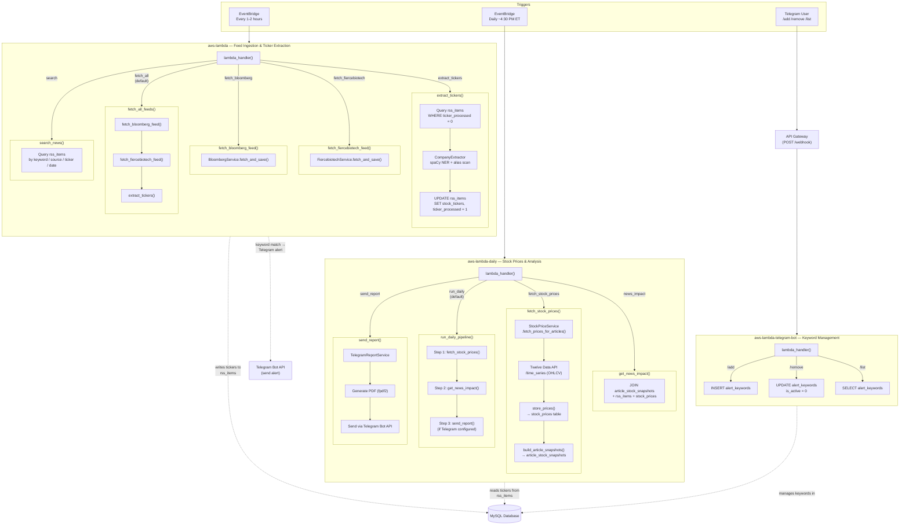
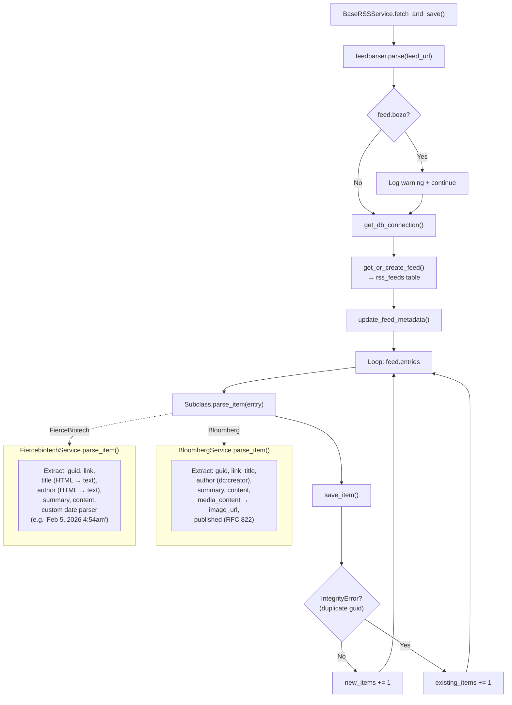
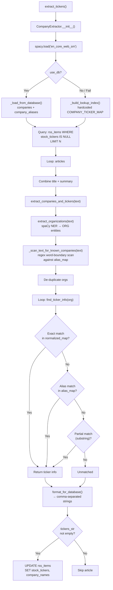
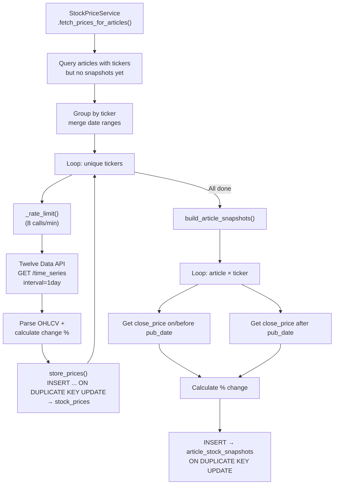
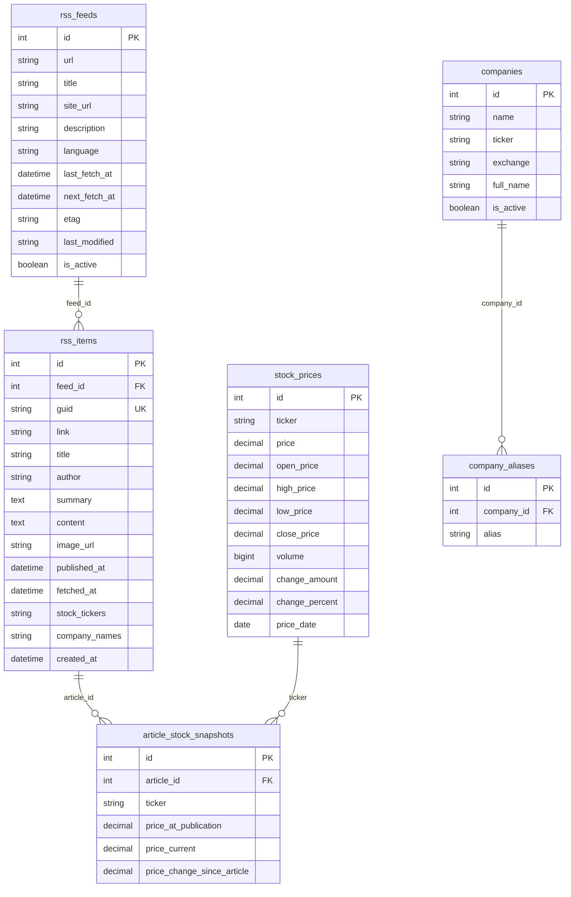

# System Flowchart — Three-Lambda Architecture

## High-Level Architecture



## RSS Feed Fetch & Save Flow



## Ticker Extraction Flow



## Stock Price & Snapshot Flow



## Database Tables



## Service Dependency Map

```
aws-lambda/ (Feed Ingestion — runs every 1-2 hours)
├── BloombergService        (→ BaseRSSService → feedparser, pymysql)
├── FiercebiotechService    (→ BaseRSSService → feedparser, pymysql)
├── CompanyExtractor        (→ spacy, pymysql, stock_ticker_data)
└── KeywordAlertService     (→ Telegram Bot API, pymysql)

aws-lambda-daily/ (Stock Prices & Analysis — runs once daily after market close)
├── StockPriceService       (→ Twelve Data API, pymysql)
└── TelegramReportService   (→ fpdf2, Telegram Bot API, pymysql)  [optional]

aws-lambda-telegram-bot/ (Keyword Management — API Gateway webhook)
└── lambda_function.py      (→ Telegram Bot API, pymysql)
```

## Recommended Schedules

| Lambda | Trigger | Rationale |
|---|---|---|
| `aws-lambda` | `rate(1 hour)` or `cron(0 */2 * * ? *)` | Frequent feed ingestion to catch new articles |
| `aws-lambda-daily` | `cron(30 21 ? * MON-FRI *)` (4:30 PM ET) | After US market close so all daily prices are final |
| `aws-lambda-telegram-bot` | API Gateway POST `/webhook` | Receives Telegram bot commands in real time |

## Environment Variables

### aws-lambda (Feed Ingestion)

| Variable | Description |
|---|---|
| `DB_HOST` | MySQL host |
| `DB_USER` | MySQL user |
| `DB_PASSWORD` | MySQL password |
| `DB_NAME` | MySQL database name |
| `DB_PORT` | MySQL port (default: 3306) |
| `TELEGRAM_BOT_TOKEN` | Telegram bot token (for keyword alerts) |
| `TELEGRAM_CHAT_ID` | Telegram chat ID (for keyword alerts) |

### aws-lambda-daily (Stock Prices & Analysis)

| Variable | Description |
|---|---|
| `DB_HOST` | MySQL host |
| `DB_USER` | MySQL user |
| `DB_PASSWORD` | MySQL password |
| `DB_NAME` | MySQL database name |
| `DB_PORT` | MySQL port (default: 3306) |
| `TWELVE_DATA_API_KEY` | Twelve Data API key |
| `TELEGRAM_BOT_TOKEN` | Telegram bot token (optional, for reports) |
| `TELEGRAM_CHAT_ID` | Telegram chat ID (optional, for reports) |

### aws-lambda-telegram-bot (Keyword Management)

| Variable | Description |
|---|---|
| `DB_HOST` | MySQL host |
| `DB_USER` | MySQL user |
| `DB_PASSWORD` | MySQL password |
| `DB_NAME` | MySQL database name |
| `DB_PORT` | MySQL port (default: 3306) |
| `TELEGRAM_BOT_TOKEN` | Telegram bot token |
| `TELEGRAM_CHAT_ID` | Restrict commands to this chat (optional) |
